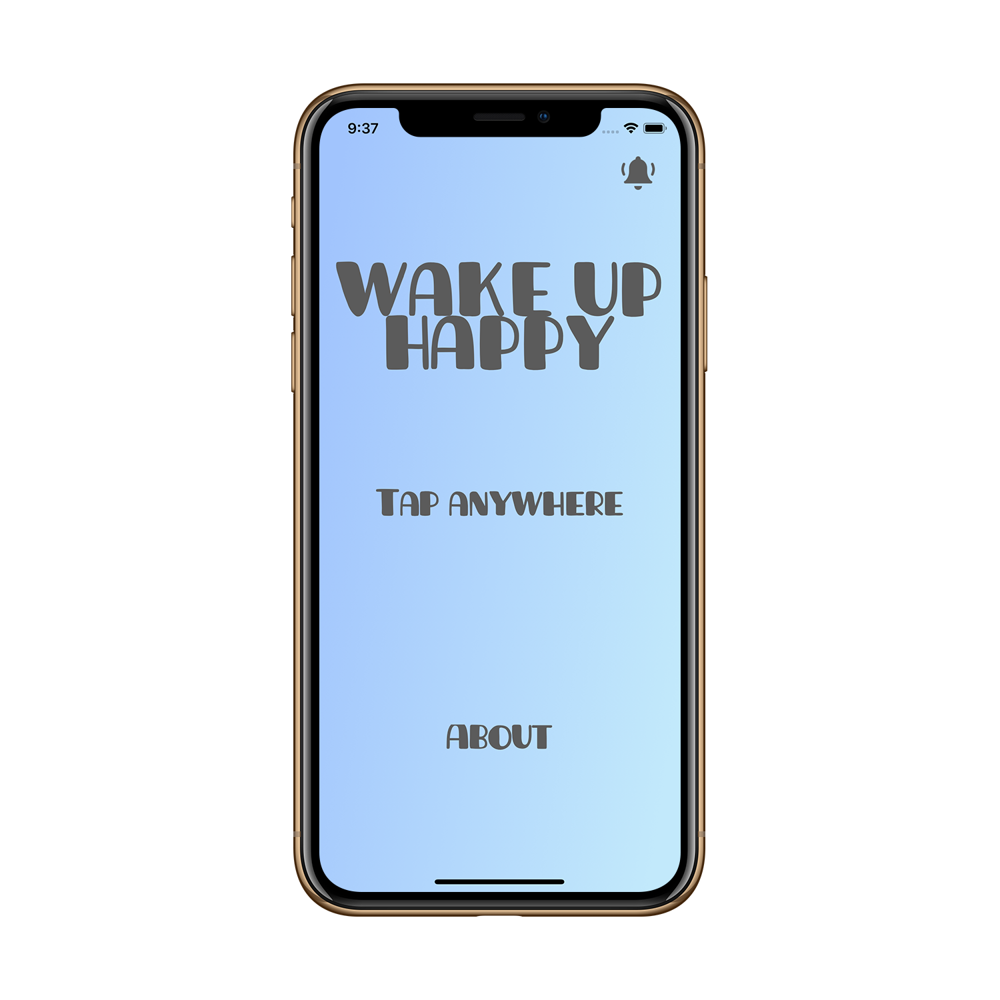
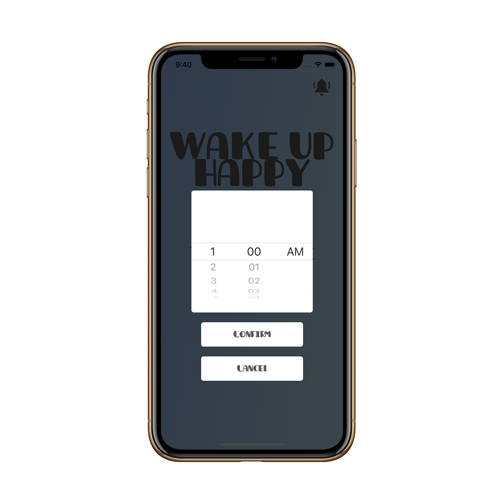
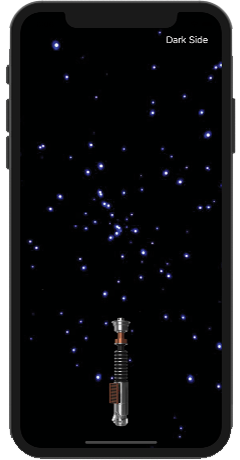
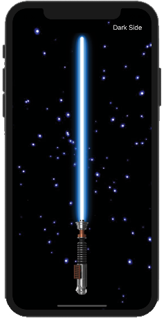
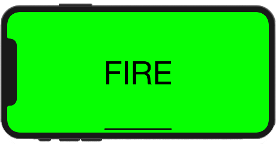
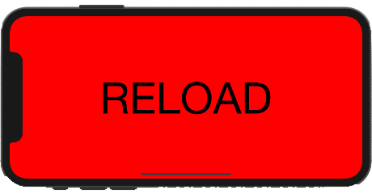

# Wake Up Happy

Wake Up Happy is an iOS video streaming notification reminder app. This app was an idea I had when I first started learning Swift iOS programming, a project I started but couldn't finish at the time due to my lack of knowledge in Swift. Ideally, I would love to publish this to the App Store and be used by those who could use a little bit more happiness in their mornings. Wake Up Happy opens up to a tap screen that plays a video, includes an "About" page and has notification functionality that the user can set to create reminders to watch a video at a certin time every morning.

I am extremely proud with how the app turned out and that I was able to bring it to completion. The next step now is to expand the database of videos. With Wake Up Happy, I continued my journey using the MVC architecture while learning and using the UserNotifications framework. I also utilized UIPickerView that allow users to set their own reminder time. I used Firebase as the backend and for video storage. And like with all my apps, Wake Up Happy was created without storyboards.

&nbsp;&nbsp;&nbsp;&nbsp;&nbsp;&nbsp;&nbsp;&nbsp;&nbsp;&nbsp;

# Lightsaber

Lightsaber is an iOS motion gesture app, a throwback to the early iPhone days and the single color lightsaber apps. I was inspired by such apps and decided to try my hand at coding my own virtual lightsaber. The lightsaber opens with a tap of a button, and lightsaber sound effects are played with each swing of your iPhone. The app currently features two lightsabers, Luke Skywalker's and Darth Vader's.

I am really happy with this project, however, it is not at its final version as I plan to add a variety of lightsabers. Lightsaber was my second app using the MVC pattern, as I wanted to continue practicing and challenging my skills with the MVC architecture pattern. Lightsaber really cemented the MVC pattern into my coding habits, to which I feel very proud of. Additionally, Lightsaber utilizes Auto Layout (no storyboard) for UI design, UIView animations, and UIEvent motion gestures.

&nbsp;&nbsp;&nbsp;&nbsp;&nbsp;&nbsp;&nbsp;&nbsp;&nbsp;&nbsp;

# Shotgun

Shotgun is an iOS motion gesture app. This project was an idea I got when I was thinking about existing apps that were simple enough for me to recreate. I somehow stumbled upon the thought of the old shotgun gesture apps, and so I went to work. This was my first time working with the MVC architecture pattern, as simple as this app is, I really take pride in that fact that I was able to correctly utilize the MVC pattern into this project. Prior to this, I had been studying/reading/practicing the MVC and MVVM patterns. In Shotgun, you first tap on reload to load the shotgun--then somewhat-violently--cock your iPhone upwards and back to simulate gun recoil, which then plays a shotgun sound effect.

I was extremely happy with how the app turned out, especially with Shotgun being one of my first apps that could be on the App Store. I'm proud of the fact that I was able to correctly utilize the MVC architecture pattern while utilizing variable closures and UIEvent motion gestures.

