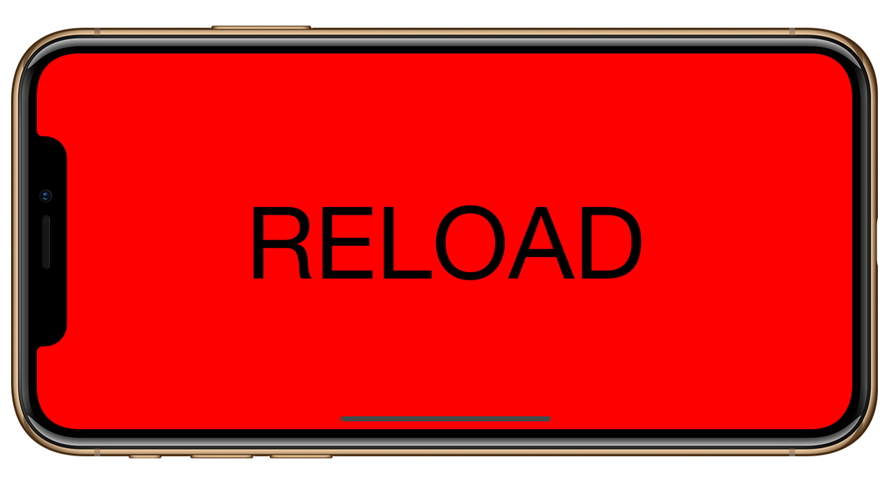

# TrashMapr 
###### [Download](https://www.trashmapr.com)
TrashMapr is an iOS app that helps its users locate nearby trash cans. When I lived in Seoul, South Korea for a few years, I noticed one problem I had on a daily basis, which was finding a trash can for my coffee cup. I told myself, that if there were ever a phone app to help you find the nearest trash can, I'd download it, and I'd use the hell out of it. Years later, today, I built an app from this idea and need I had at the time.

I am extremely excited and proud with the completion and release of TrashMapr. TrashMapr is my first iOS release and was a complete learning process. I honed my skills in the MVC and MVVM design patterns, core libraries such as UIKit and CoreLocation, and third-party libraries. Finally I dove deeply into the Google Maps API as well as Firebase and GeoFire for handling user info, phone authentication and geo-mapping of trash cans.

TrashMapr is available for download on the Apple App Store, and currently displays locations of trash cans in San Francisco and Los Angeles. The plan is to add more cities to the app starting with New York and Seattle, and to hopefully work with city organizations to streamline trash can placements and tracking of usage.

### Tech:
UIKit
Google Maps API
Firebase/GeoFire
Various third-party libraries

# ApeRocket 
###### [Download](https://apps.apple.com/us/app/aperocket/id1560237608)
ApeRocket is a 2D iOS game comprised of three different modes. Two are inspired by the Flappy Bird game, the third is the same inspiration mixed with AR face-tracking components. ApeRocket includes Apple's Game Center Leaderboards API.

ApeRocket is my first mobile game. I made it a goal to complete it under a month and blew it out the water. Through this process I learned a lot about iPhone screen sizes (sizing differs with UIKit, SpriteKit, and ARKit) and how best to frame UI game elements to scale properly on all devices having come from UIKit's Auto Layout. One part of this app I really enjoyed working on was the AR portion, where I learned how to track faces and check for facial expressions.

### Tech:
SpriteKit\
GameKit / Game Center\
ARKit / TrueDepth API

# Wake Up Happy

Wake Up Happy is a video streaming app. This is a personal project where I wanted to dig deeper into UIKit, MVC design pattern, and Firebase. The goal of the app is to present the user with notification each morning of a happy video to set the day's mood for them.

I am extremely proud with how the app turned out and that I was able to bring it to completion. A few things I mastered were UserNotifications, UIPickerView, and storing videos via Firebase. I'd love to bring this project back up and publish it to the App Store someday.

### Tech:
UIKit\
Firebase

&nbsp;&nbsp;&nbsp;&nbsp;&nbsp;&nbsp;&nbsp;&nbsp;&nbsp;&nbsp;

# Lightsaber

Lightsaber is an iOS motion gesture app, a throwback to the early iPhone days and the single color lightsaber apps. I was inspired by such apps and decided to try my hand at coding my own virtual lightsaber. The lightsaber opens with a tap of a button, and lightsaber sound effects are played with each swing of your iPhone. The app currently features two lightsabers, Luke Skywalker's and Darth Vader's.

I am really happy with this project, however, it is not at its final version as I plan to add a variety of lightsabers. Lightsaber was my second app using the MVC pattern, as I wanted to continue practicing and challenging my skills with the MVC architecture pattern. Lightsaber really cemented the MVC pattern into my coding habits, to which I feel very proud of. Additionally, Lightsaber utilizes Auto Layout (no storyboard) for UI design, UIView animations, and UIEvent motion gestures.

&nbsp;&nbsp;&nbsp;&nbsp;&nbsp;

# Shotgun

Shotgun is an iOS motion gesture app. This project was an idea I got when I was thinking about existing apps that were simple enough for me to recreate. I somehow stumbled upon the thought of the old shotgun gesture apps, and so I went to work. This was my first time working with the MVC architecture pattern, as simple as this app is, I really take pride of the fact that I was able to correctly utilize the MVC pattern into this project. Prior to this, I had been studying/reading/practicing the MVC and MVVM patterns. In Shotgun, you first tap on reload to load the shotgun--then somewhat-violently--cock your iPhone upwards and back to simulate gun recoil, which then plays a shotgun sound effect.

I was extremely happy with how the app turned out, especially with Shotgun being one of my first apps that could be on the App Store. I'm proud of the fact that I was able to correctly utilize the MVC architecture pattern while utilizing variable closures and UIEvent motion gestures.

